<p align="center">
  
</p>

# LinuxIA — Proof-First Agent Ops

> Orchestration multi-VM, agents systemd, preuve à chaque commit.

---

<!-- LINUXIA:HERO_3D:START -->
## Hero NASA 3D — Vision · Architecture · Agents · Proof

<p align="center">
  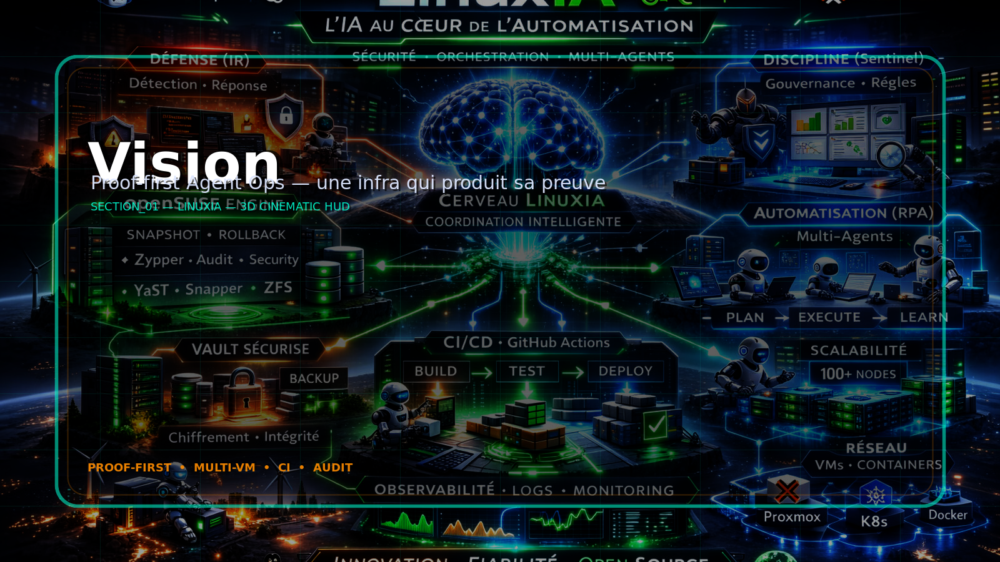
</p>
<p align="center">
  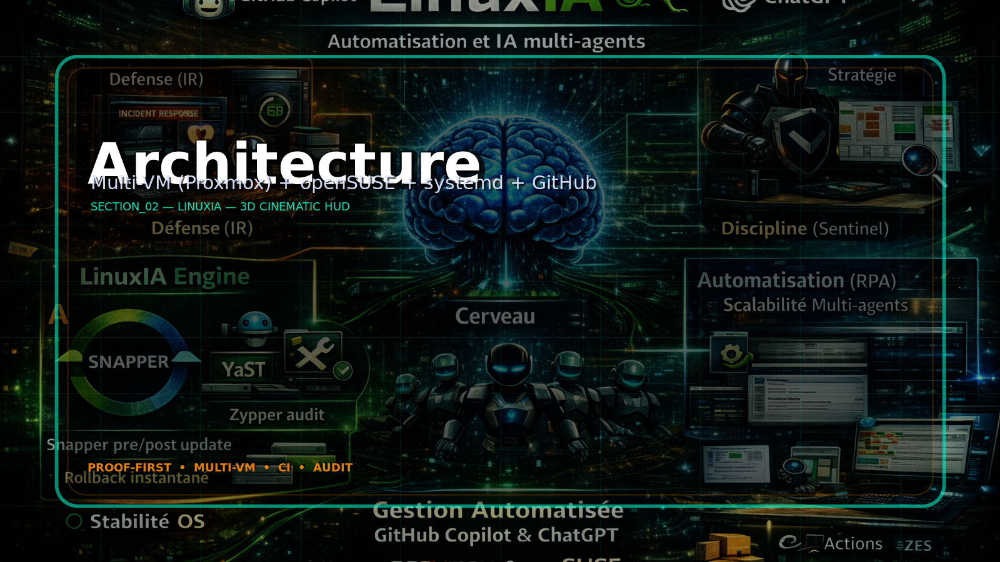
</p>
<p align="center">
  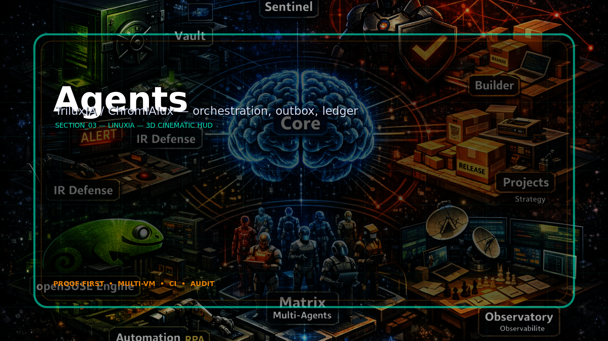
</p>
<p align="center">
  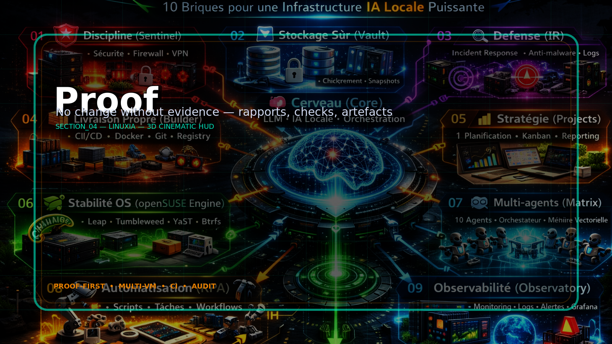
</p>

<!-- LINUXIA:HERO_3D:END -->

---

<!-- LINUXIA:TRAILERS:START -->
## 🎬 Trailers

<p align="center">
  <a href="assets/readme/videos/Trailer_01.mp4">
    
  </a>
  &nbsp;
  <a href="assets/readme/videos/Trailer_02.mp4">
    
  </a>
</p>

> 🎵 Theme: [Theme_01.mp3](assets/readme/audio/Theme_01.mp3)

<!-- LINUXIA:TRAILERS:END -->

---

<!-- LINUXIA:GALLERY:START -->
## Gallery

<p align="center">
  
  
  
  
</p>
<p align="center">
  
  
  
  
</p>

<!-- LINUXIA:GALLERY:END -->

---

<!-- LINUXIA:ANIMATIONS:START -->
## Infra · Security · Storage · Roadmap

<p align="center">
  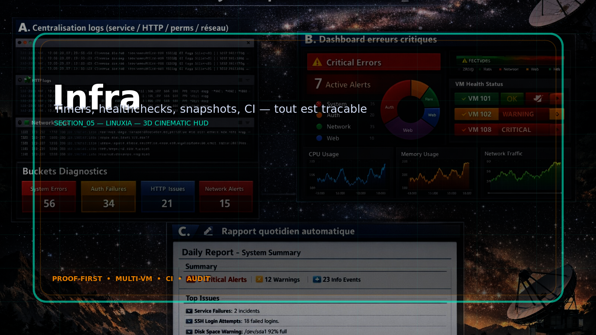
  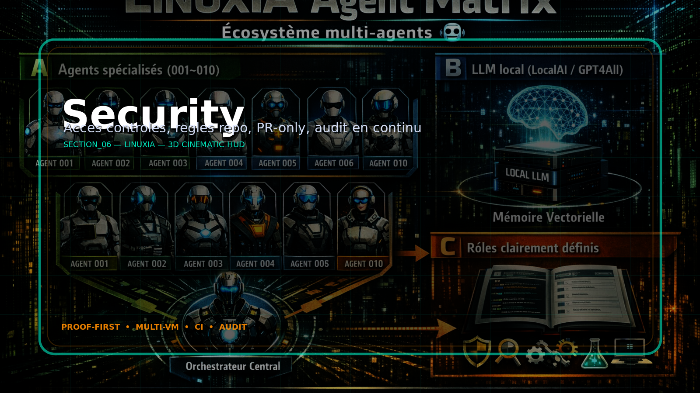
</p>
<p align="center">
  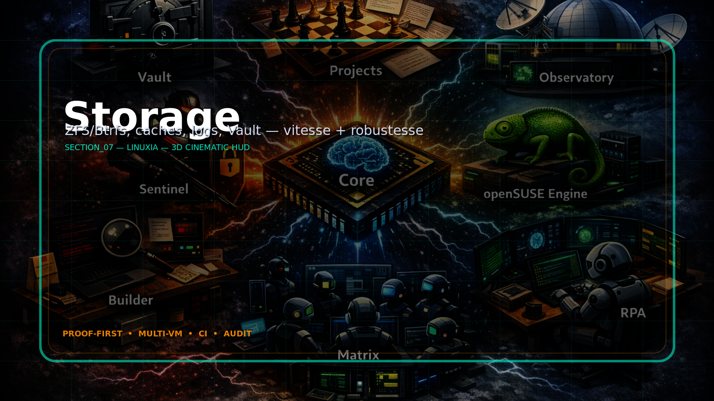
  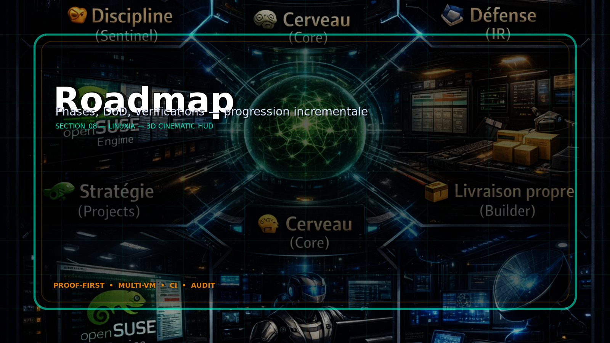
</p>

<!-- LINUXIA:SECTIONS_REST:END -->

---

## What

Automated infrastructure ops with **mandatory proof generation**:

- Every change → timestamped evidence
- Scripts: bash + shellcheck + `set -euo pipefail`
- Systemd timers (configsnap, healthchecks, reports)
- GitHub PR workflow + CI

---

---

## Architecture

- **VM100** (`vm100-factory`): Main repo, storage, Samba, health reports
- **VM101** (`vm101-layer2`): CIFS client, independent proofs
- **VM102** (`vm102-tool`): Sandbox, tests, API orchestrator

---

---

## Quick Start

```bash
git clone git@github.com:Topbrutus/LinuxIA.git /opt/linuxia
cd /opt/linuxia
bash scripts/verify-platform.sh
# Should show: OK=24 WARN=0 FAIL=0
```

---

---

## Status

* **Latest:** Phase 6 merged (health reports + systemd timers)
* **Proof:** See [docs/status.md](docs/status.md)
* **Runbook:** [docs/runbook.md](docs/runbook.md)
* **Checklists:** [docs/checklists/](docs/checklists/)

---

---

## Guides

- [Mode d'emploi — Linux Mint 22.2 → Agent maison](docs/Mode_emploi_LinuxMint22_2_Agent_Maison.md)

---

---

## Contribute

See [CONTRIBUTING.md](CONTRIBUTING.md) |
[Good First Issues](https://github.com/Topbrutus/LinuxIA/labels/good%20first%20issue)

---

---

## License

To be determined

## 🧩 Hub Animations

<p align="center">
  
  
  
</p>
<p align="center">
  
  
  
</p>
<p align="center">
  
  
  
</p>

<!-- LINUXIA_CINEMATIC_BEGIN -->


## 🌌 Vitrine cinématique (GitHub-safe)

<p align="center">
  
</p>

<p align="center">
  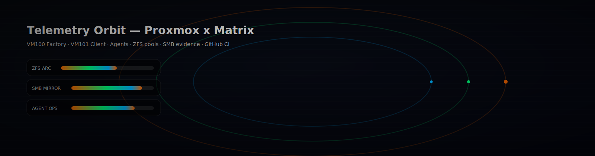
</p>

### 🔥 Ce que cette vitrine démontre (sans JavaScript)

- **Animations SMIL** (compatibles GitHub) : gradients, orbits, scans, glow
- **Design NASA-tech** + **Proxmox orange** + **Matrix green** + accents multi
- **Narration ops** : Health → Ledger → Proof → Orchestration
- **Lisible** et "wow" : fine, technique, complexe, mais propre

<!-- LINUXIA_CINEMATIC_END -->


<!-- LINUXIA_README_SUITE_BEGIN -->

<p align="center">
  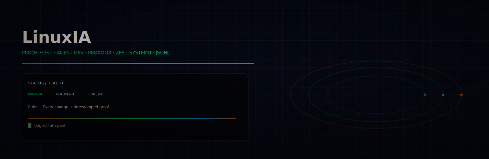
</p>

<p align="center">
  
</p>

## 🚀 LinuxIA — Proof-First Agent Ops

LinuxIA est un framework d'opérations infra **orienté preuves** : chaque changement déclenche des vérifications,
génère des rapports, et dépose des éléments d'évidence exploitables (audit).

### 🧠 Suite (symétrique, bloc → bloc)

<p align="center">
  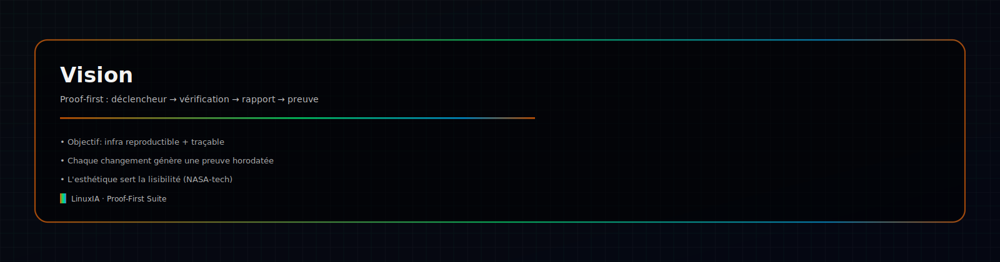
</p>

<p align="center">
  
</p>

<p align="center">
  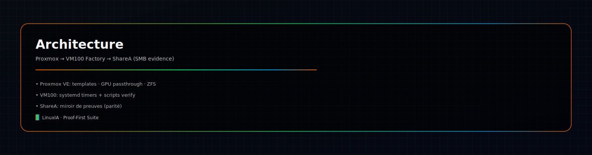
</p>

<p align="center">
  
</p>

<p align="center">
  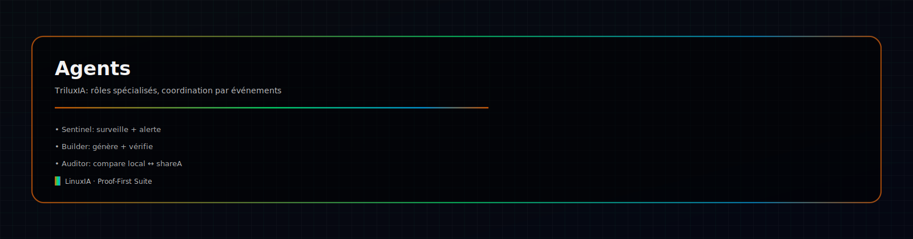
</p>

<p align="center">
  
</p>

<p align="center">
  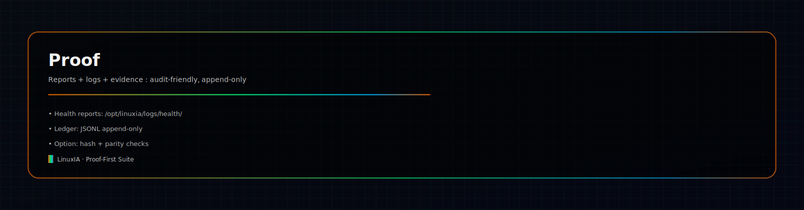
</p>

### ✅ Règle d'or

> **Every change → timestamped proof.**

<!-- LINUXIA_README_SUITE_END -->
