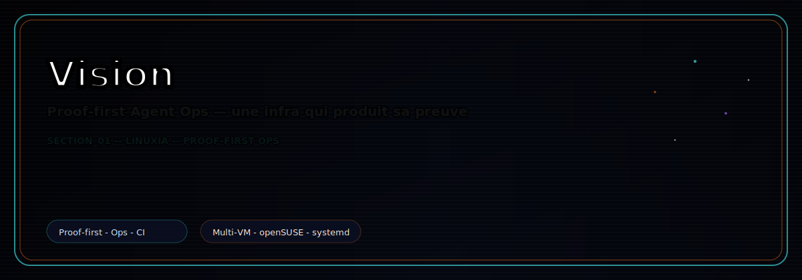
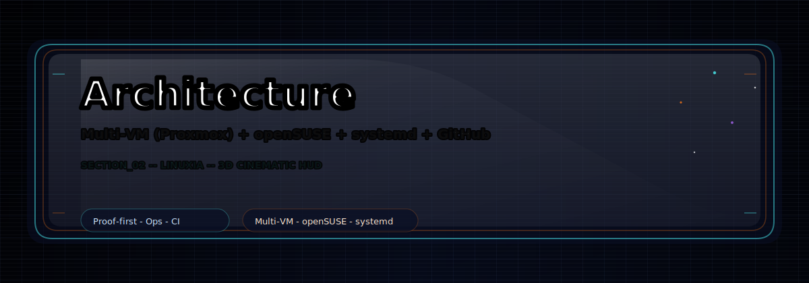
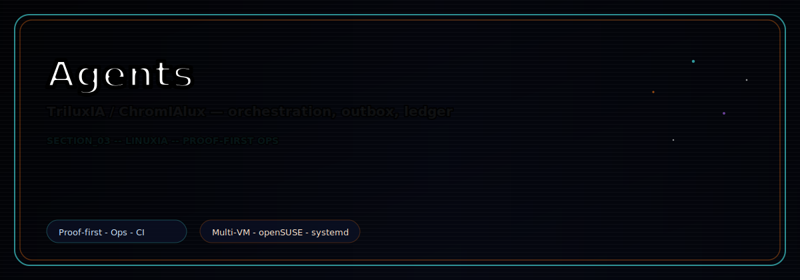
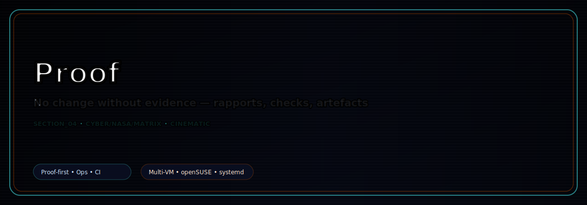
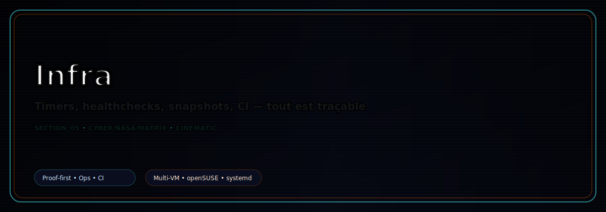
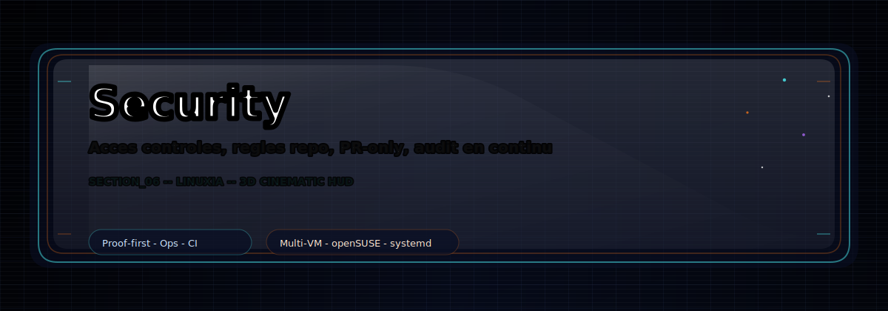
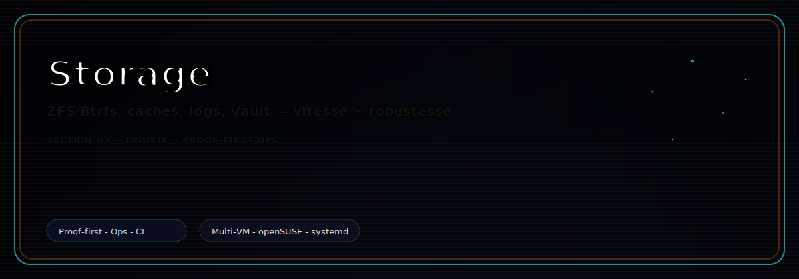
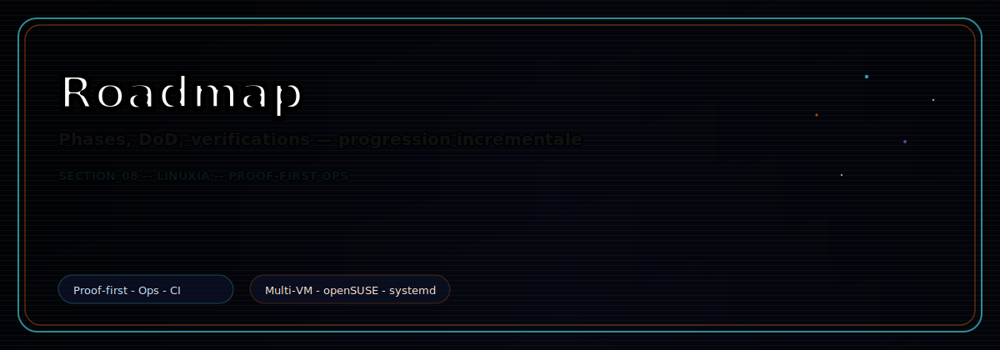

<p align="center">
  

</p>

# LinuxIA — Proof-First Agent Ops

<!-- LINUXIA:SHOWCASE_CINEMATIC:START -->
## Showcase Cinematic

<p align="center">
  
</p>

<p align="center">
  
</p>

<p align="center">
  
</p>

<p align="center">
  
</p>

<p align="center">
  
</p>

<p align="center">
  
</p>

<p align="center">
  
</p>

<p align="center">
  
</p>

> Echange `assets/readme/gallery/p01.jpg` ... `p08.jpg` pour changer les photos sans toucher au README.

<!-- LINUXIA:SHOWCASE_CINEMATIC:END -->

<!-- LINUXIA:TRAILERS_MP4:START -->
## Trailers (MP4)

> GitHub n'embed pas les MP4 inline, mais les liens ci-dessous ouvrent les videos.

<p align="center">
  <a href="assets/readme/mp4/section_01_vision.mp4"></a>
  <a href="assets/readme/mp4/section_02_architecture.mp4"></a>
  <a href="assets/readme/mp4/section_03_agents.mp4"></a>
  <a href="assets/readme/mp4/section_04_proof.mp4"></a>
  <a href="assets/readme/mp4/section_05_infra.mp4"></a>
  <a href="assets/readme/mp4/section_06_security.mp4"></a>
  <a href="assets/readme/mp4/section_07_storage.mp4"></a>
  <a href="assets/readme/mp4/section_08_roadmap.mp4"></a>
</p>
<!-- LINUXIA:TRAILERS_MP4:END -->


[](https://github.com/Topbrutus/LinuxIA/pulls?q=is%3Apr+is%3Aclosed)
[](docs/runbook.md)

**Proof-first multi-VM orchestration** (Proxmox + openSUSE + systemd + GitHub)

---

## What

Automated infrastructure ops with **mandatory proof generation**:

- Every change → timestamped evidence
- Scripts: bash + shellcheck + `set -euo pipefail`
- Systemd timers (configsnap, healthchecks, reports)
- GitHub PR workflow + CI

---

## Architecture

- **VM100** (`vm100-factory`): Main repo, storage, Samba, health reports
- **VM101** (`vm101-layer2`): CIFS client, independent proofs
- **VM102** (`vm102-tool`): Sandbox, tests, API orchestrator

---

## Quick Start

```bash
git clone git@github.com:Topbrutus/LinuxIA.git /opt/linuxia
cd /opt/linuxia
bash scripts/verify-platform.sh
# Should show: OK=24 WARN=0 FAIL=0
```

---

## Status

* **Latest:** Phase 6 merged (health reports + systemd timers)
* **Proof:** See [docs/status.md](docs/status.md)
* **Runbook:** [docs/runbook.md](docs/runbook.md)
* **Checklists:** [docs/checklists/](docs/checklists/)

---

## Media

- 🎵 Theme: [Theme_01.mp3](assets/readme/audio/Theme_01.mp3)
- 🎬 Trailer 01: [Trailer_01.mp4](assets/readme/videos/Trailer_01.mp4)
- 🎬 Trailer 02: [Trailer_02.mp4](assets/readme/videos/Trailer_02.mp4)

## Guides

- [Mode d'emploi — Linux Mint 22.2 → Agent maison](docs/Mode_emploi_LinuxMint22_2_Agent_Maison.md)

---

## Gallery (temporary small thumbnails)

<p align="center">
  
  
  
  
</p>

<p align="center">
  
  
  
  
</p>

<p align="center">
  
  
  
</p>


## Animations SVG

> Sélection des meilleures animations (SVG). Clique pour ouvrir en grand.

[](assets/readme/animations/anim_01_score90.svg) | [](assets/readme/animations/anim_02_score11.svg) | [](assets/readme/animations/anim_03_score9.svg)
[](assets/readme/animations/anim_04_score15.svg) | [](assets/readme/animations/anim_05_score25.svg) | [](assets/readme/animations/anim_06_score175.svg)
[](assets/readme/animations/anim_07_score11.svg) | [](assets/readme/animations/anim_08_score9.svg) | [](assets/readme/animations/anim_09_score422.svg)


## Contribute

See [CONTRIBUTING.md](CONTRIBUTING.md) |
[Good First Issues](https://github.com/Topbrutus/LinuxIA/labels/good%20first%20issue)

---

## License

To be determined
