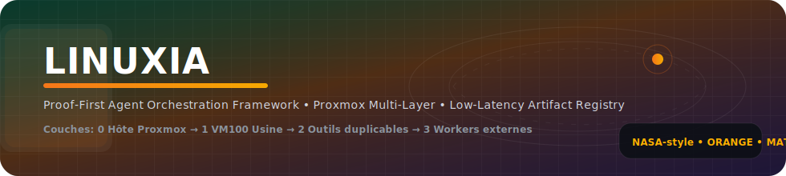
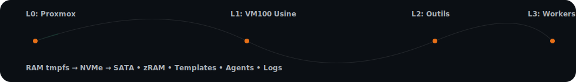

<!--
LINUXIA_README_VNEXT_REBUILD
Thème: NASA / Proxmox / Matrix — accents orange, animations fines, propres, GitHub-safe.
-->

<!-- LOGO / HERO (SVG animé, fin et léger) -->

  
  
  
  

---

## 🧠 LinuxIA — c'est quoi?

LinuxIA est une infrastructure **multi-couches** bâtie autour de **Proxmox VE** (KVM + LXC) pour orchestrer des environnements duplicables, **pilotés par preuves** (logs, checks, DoD), avec un objectif clair :

- **Latence minimale** (données "ultra-hot" en RAM + NVMe)
- **Ordonnancement maîtrisé** (couches, templates, agents, règles de priorité)
- **Résilience** (isolation VM/CT, quotas, dégradation progressive via zRAM)

---

## 🛰️ Architecture en 4 couches (Proxmox-native)

### Couche 0 — Hôte Proxmox (Orchestrateur)
- Hyperviseur & gestion ressources CPU/RAM/IO
- "Oracle mémoire" (pression RAM → actions correctives, priorité, protection)
- Stockage central des artefacts & caches partagés

### Couche 1 — VM100 "Usine" (Factory)
- Forge de **templates** (CT/VM) et **artefacts**
- Standardisation des environnements
- Pipeline de mise à jour: rebuild → test → diffusion

### Couche 2 — Outils duplicables ("Chromium")
- Instances clonées depuis template (rapide, homogène, isolé)
- Mini-agent local: exécution, supervision, dépôt d'artefacts, reporting
- Scalabilité horizontale (création/destruction rapide)

### Couche 3 — Workers externes
- Extension de capacité (CPU/GPU) sur nœuds satellites (cluster ou SSH/API)
- Déport de charges lourdes, tolérance accrue

---

## ⚡ Mémoire & stockage "Thermal-Tier" (Ultra-Hot → Hot → Cold)

- **tmpfs** en RAM (slots dédiés) pour données ultra-chaudes
- **NVMe** pour artefacts chauds persistants et images actives
- **SATA** pour archivage cold (artefacts peu consultés)
- **zRAM** (swap compressé) en priorité, swap disque en dernier filet

---

## 🧩 Principes "Proof-First"
Chaque étape doit être:
- **Reproductible**
- **Vérifiable**
- **Traçable** (logs, scripts, checks, artefacts)

---

## 🖼️ Media Vault — Gallery (11)

---

## �� Animated "Matrix Trace" (SVG micro-animation)

---

## 🎥 Vidéos

| Fichier | Description |
|---------|-------------|
| [Trailer_01.mp4](assets/readme/videos/Trailer_01.mp4) | Trailer LinuxIA #1 |
| [Trailer_02.mp4](assets/readme/videos/Trailer_02.mp4) | Trailer LinuxIA #2 |

---

## 🔊 Audio

| Fichier | Description |
|---------|-------------|
| [Theme_01.mp3](assets/readme/audio/Theme_01.mp3) | Thème principal LinuxIA |

---

## 🧪 Quick Facts
- Proxmox VE (Type-1) : **KVM + LXC** sur un orchestrateur central
- Templates : **déploiement en secondes**
- Artefacts multi-niveaux : **RAM → NVMe → SATA**
- Protection mémoire : **zRAM prioritaire + quotas + isolation**
- Extensible : **workers externes** (cluster ou orchestration SSH/API)
- Philosophie : **Proof-First** (logs + checks + DoD)

---

## 📁 Convention d'assets (repo)

\`\`\`
assets/
  readme/
    gallery/     LinuxIA_02.jpg … LinuxIA_12.jpg
    videos/      Trailer_01.mp4, Trailer_02.mp4
    audio/       Theme_01.mp3
\`\`\`

---

## 🔗 Docs

- [Start here](docs/start-here.md) — prerequisites, quickstart
- [Architecture](docs/architecture.md) — Mermaid diagrams, VM topology
- [Runbook](docs/runbook.md) — troubleshooting
- [RISKS.md](RISKS.md) — risk matrix R1–R7
- [SECURITY.md](SECURITY.md) — disclosure policy
