# 🧠 LinuxIA — Proof-First Agent Ops

<p align="center">
  
</p>

> **LinuxIA n'est pas un projet. C'est un organisme informatique distribué.**
> Chaque action laisse une preuve. Chaque agent a un rôle. Chaque VM est un organe.

**LinuxIA** is a self-hosted, proof-first multi-agent AI platform running on Proxmox VE. Every infrastructure change generates timestamped evidence stored in append-only logs and shared storage. AI proposes — humans validate.

> 🆕 **New here?** → [**docs/start-here.md**](docs/start-here.md) — platform overview, prerequisites, and 3-command quickstart.

---

## 🚀 Quick Start

```bash
# Clone the repository (requires write access to /opt/linuxia on VM100)
git clone git@github.com:Topbrutus/LinuxIA.git /opt/linuxia
cd /opt/linuxia

# Syntax-check all scripts
bash -n scripts/verify-platform.sh

# Run platform verification (read-only)
bash scripts/verify-platform.sh

# Run system health check
bash scripts/linuxia-healthcheck.sh
```

> ℹ️ On VM100, the repository lives at `/opt/linuxia`. To clone elsewhere (e.g., for local development), omit the target path.

---

## 🧩 Hub Status

<p align="center">
  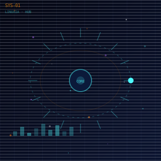
  
  
  
  
  
</p>
<p align="center">
  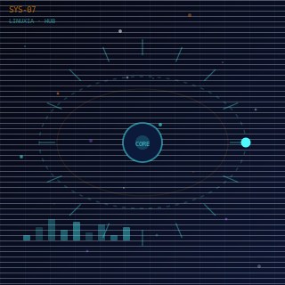
  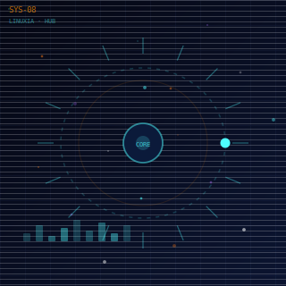
  
</p>

---

## 🌌 Architecture & Orchestration

<p align="center">
  
</p>

## 🤖 Agents TriluxIA

<p align="center">
  
</p>

## 🛡️ Immutable Proof

<p align="center">
  
</p>

## ⚙️ Infra & Timers

<p align="center">
  
</p>

## 🔒 Security

<p align="center">
  
</p>

## 💾 Storage

<p align="center">
  
</p>

## 🗺️ Roadmap

<p align="center">
  
</p>

---

## 🖥️ VM Architecture

| VM | Role | Key Services |
|----|------|--------------|
| **VM100** Factory | Control plane, orchestration | systemd timers, configsnap, runbooks |
| **VM101** Layer2 | Specialized agents (research, analysis) | Agent containers |
| **VM102** Tool | Dedicated tooling agents | Tool containers |

---

## 📁 Repository Structure

```
/opt/linuxia/
├── scripts/          # Operational scripts (verify-platform, healthcheck…)
├── services/         # SystemD unit files and timers
├── docs/             # Documentation (runbook, security, verifications…)
├── ops/              # VM setup and orchestrator guides
├── sessions/         # Session logs (not in Git)
├── data/             # Shared storage (not in Git)
│   ├── shareA/       # Archives and configsnap evidence
│   └── shareB/       # Shared workspace
└── logs/             # Application logs (not in Git)
```

---

## 📚 Documentation

- [Inventory](docs/INVENTORY.md) — Complete reference: all scripts, animations, services, and error-free install procedure
- [Runbook](docs/runbook.md) — Operational procedures for VM100
- [Project Overview](docs/PROJECT_OVERVIEW.md) — Architecture and design decisions
- [Security](docs/security.md) — Security principles and configurations
- [Verification Scripts](docs/verify.md) — SystemD verification usage
- [Contributing](CONTRIBUTING.md) — Contribution guidelines and PR checklist
- [Security Policy](SECURITY.md) — Vulnerability reporting
- [Risks & Mitigations](RISKS.md) — Risk posture: LLM, infra, CI, governance (Palier 1–2)

---

## 🎬 Media Vault

<p align="center">
  <a href="assets/readme/videos/Trailer_01.mp4">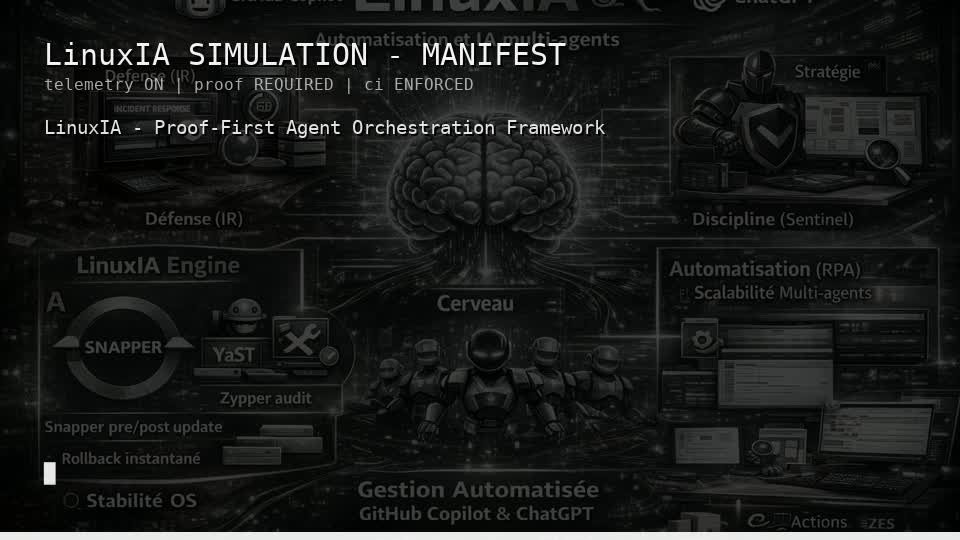</a>
  <a href="assets/readme/videos/Trailer_02.mp4">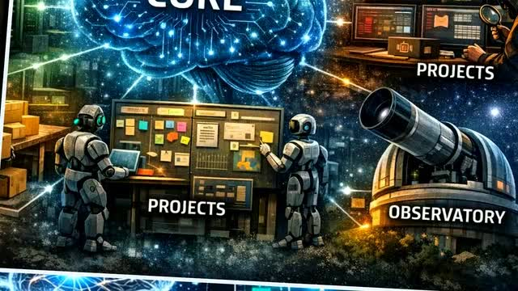</a>
</p>


- **Trailer 01**: [Watch](assets/readme/videos/Trailer_01.mp4)
- **Trailer 02**: [Watch](assets/readme/videos/Trailer_02.mp4)
- **Theme Audio**: [Listen](assets/readme/audio/Theme_01.mp3)

---

<p align="center">
  
  <br/>
  <sub>© 2026 LINUXIA PROJECT • MISSION CONTROL v1.5.0</sub>
</p>

<!-- LINUXIA_VITRINE_CARDS_BEGIN -->


## 🖼️ Vitrine — Cinematic Cards

<p align="center">
  
</p>
<p align="center">
  
</p>
<p align="center">
  
</p>
<p align="center">
  
</p>
<p align="center">
  
</p>
<p align="center">
  
</p>
<p align="center">
  
</p>
<p align="center">
  
</p>

<!-- LINUXIA_VITRINE_CARDS_END -->

## ✨ Animations

<p align="center">
  
</p>

<p align="center">
  
  
  
</p>

