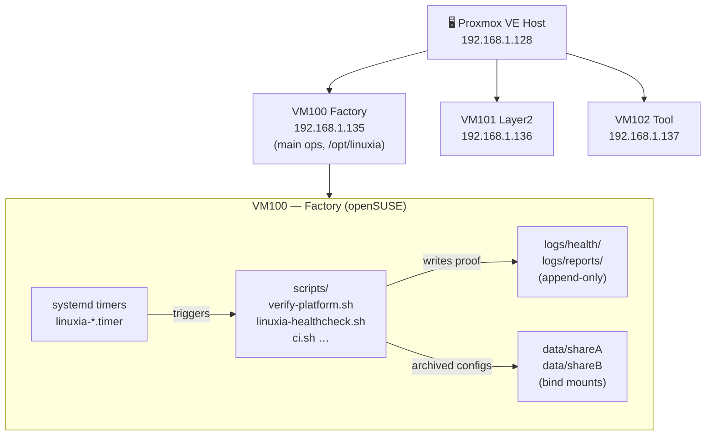
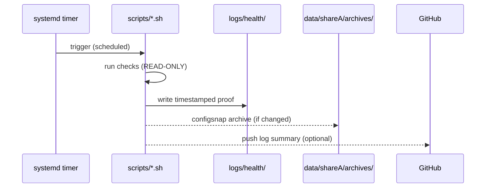
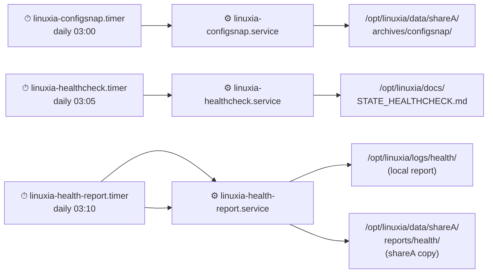
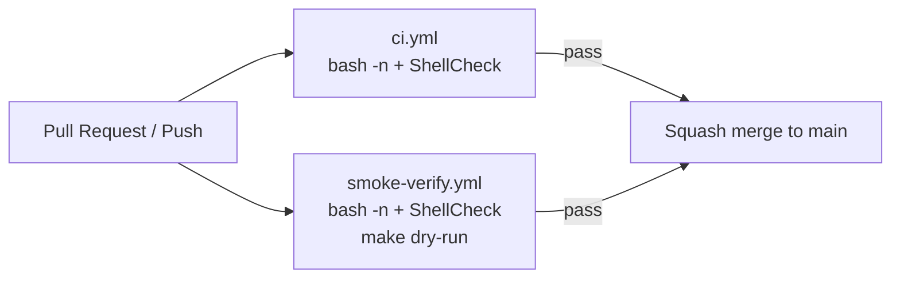

# 🏗️ LinuxIA — Architecture

> High-level map of the platform: VMs, data flows, scripts, and CI.

---

## Infrastructure Overview

---

## Scripts → Logs Flow

---

## Timers / Services → Output Paths

---

## CI / GitHub Actions

All CI jobs are **read-only** — they check syntax, they do not run the scripts against a live system.

---

## Key Paths

| Path | Role |
|------|------|
| `/opt/linuxia/scripts/` | All runnable scripts |
| `/opt/linuxia/logs/health/` | Append-only health logs |
| `/opt/linuxia/data/shareA/` | Bind-mounted shared storage A |
| `/opt/linuxia/data/shareB/` | Bind-mounted shared storage B |
| `/opt/linuxia/data/shareA/archives/configsnap/` | Config snapshots |
| `/opt/linuxia/services/` | systemd unit templates |
| `/opt/linuxia/assets/readme/` | README visuals (SVGs, media) |
| `~gaby/pour_copilot/` | Agent input/output staging area |

---

## Agent Roles (TriluxIA)

| Agent | VM | Role |
|-------|----|------|
| Factory | VM100 | Main orchestrator, script runner, log writer |
| Layer2 | VM101 | Secondary processing, relay |
| Tool | VM102 | Tooling, builds, utility tasks |

Agents propose changes via `pour_copilot/` → human reviews → merge to `main` → timers apply.

---

→ Detailed script inventory: [`docs/INVENTORY.md`](INVENTORY.md)  
→ Troubleshooting: [`docs/runbook.md`](runbook.md)
